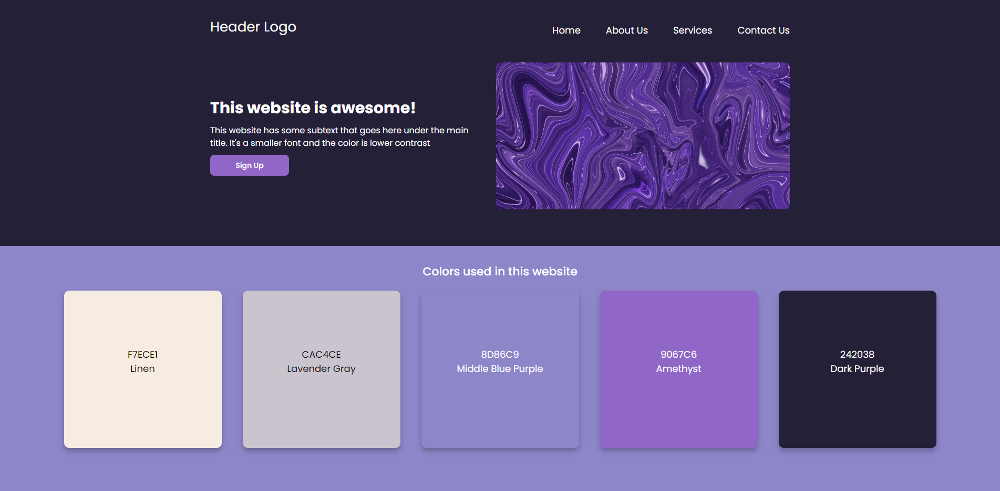

# Odin Landing Page

A simple beginner landing page that only incorporates HTML5 and CSS.
This website is meant to be viewed in desktop mode, as at this point, I have not learned
the tools for responsiveness. Future implementation will incorporate responsiveness for mobile in mind.

This project uses the essential elements and components from [The Odin Project's project template](https://cdn.statically.io/gh/TheOdinProject/curriculum/81a5d553f4073e593d23a6ab00d50eef8620796d/foundations/html_css/project/imgs/01.png), 
while allowing for the developer's customization.

## Deployment
Live at: [mcabal77.github.io/landing-page-visualization/](https://mcabal77.github.io/landing-page-visualization/)

## Usage/Examples
Feel free to look around!

## Acknowledgements

 Hero Image by [Benzoix](https://www.freepik.com/author/benzoix)
 